### [Escaneo de seguridad y vulnerabilidades de contenedores con OpenShift.](https://github.com/javilinux/conferences/tree/master/2018/supersec/escaneo)

*SuperSec 2018 Almería*

*Javier Ramirez Molina*

*OpenShift Support at Red Hat*

---

### Disclaimer

*Opiniones propias*

*Versiones upstream y cuenta de developer*

---
## Agenda

<!-- .slide: style="text-align: left;"> -->  
#### Introducción
#### Catalago de Contenedores
#### Atomic CLI + OpenSCAP
#### Cloudforms + OpenSCAP + OpenShift

---

###### ¿Que es lo que hay exactemente dentro de un contenedor? 

* Formatos de empaquetado: 
    * Docker / CRI-O / rkt.
* Inmutables basados en imagenes.
* Las imagenes estan basadas en capas
    * base, runtime, aplicación.

Note: CRI-O is an implementation of the Kubernetes CRI (Container Runtime Interface) to enable using OCI (Open Container Initiative) 

---

###### ¿Quién debería ser responsable de su seguridad? 

* Responsabilidad compartida - DevOps.
* Los contenedores no tienen contenido, son sólo procesos.

---
###### ¿Como se asemeja/diferencia a lo que hacemos con los servidores?

1. Técnología muy reciente.
2. Falta de herramientas.
3. Mucha velocidad de evolución. 
4. Seguridad no entiende de contenedores.
5. DevOPs no entienden de seguridad.
6. La seguridad puede impactar la productividad.

---
###### Catálogo de Contenedores 

- Red Hat ofrece un catálogo de todas las imagenes que proporciona.
- Son frecuentemente escaneadas y actualizadas.
- Historial de cada imagen y un tag por cada versión.
- Calificación A - F en función de las erratas.

---
#### Introducion a las erratas

- Errata: conjunto de parches liberados al mismo tiempo.
   - RHBA: Bug (Solución de problemas) 
   - RHEA: Enhancements (Mejoras de productos)
   - RHSA: Security advisories (Seguridad)

---
#### Clasificación de las erratas de seguridad
*Crítica*

- Ejecución de código arbitrario, remotamente y sin autenticación

*Importante*

- Escalación de privilegios localmente

- Acceso a recursos a invitados remotos

- Denegación servicio o ejecución código arbitrario a usuarios remotos

---
#### Clasificación de las erratas de seguridad

*Moderada*

Sólo explotables en determinadas circunstancias.

*Baja*

Resto de erratas de seguridad.

---
##### Calificación de la seguridad de las imagenes
| Calificación | Condiciones de seguridad                                        |
|--------------|--------------------------|
|A             | Sin Críticas o Importantes sin aplicar|
|B             | Crítica (7 días) o Importante (30 días)|
|C             | Crítica (30 días) o Importante (90 días)|

---
##### Calificación de la seguridad de las imagenes
| Calificación | Condiciones de seguridad                                        |
|--------------|--------------------------|
|D             | Crítica (90 dias) o Importante (1 año)|
|E             | Crítica o Importante (1 año)|
|F             | Crítica o Importante (más de 1 año)|
|UNKNOWN       | Sin datos suficientes|

---
#### Ejemplo de imagen en un catálago

https://access.redhat.com/containers/?tab=overview#/registry.access.redhat.com/openshift3/ose-sti-builder

---
#### Atomic CLI
- Con origen en el proyecto [Atomic](https://www.projectatomic.io/)
- Usa OpenScan
- Se puede instalar en Fedora/CentOS

---
#### Instalar Atomic CLI
<!-- .slide: style="text-align: left;"> -->  
- Instalar el paquete

```sh
dnf install atomic -y
```
- Determinar la imagen a escanear
<small>
```
REPOSITORY                                              TAG                 IMAGE ID            CREATED             SIZE
registry.access.redhat.com/openshift3/ose-sti-builder   v3.8.37-2           db2cc45d44f2        5 days ago          1.25 GB
registry.access.redhat.com/openshift3/ose-sti-builder   latest              9d5f7d2b5e54        10 days ago         1.23 GB
registry.access.redhat.com/openshift3/ose-sti-builder   v3.9.25             9d5f7d2b5e54        10 days ago         1.23 GB
registry.access.redhat.com/openshift3/ose-sti-builder   v3.1.1.6-9          a456510b78b0        2 years ago         442 MB
```
</small>

Note: sudo atomic images list

---
#### Escaneo con Atomic CLI

<small>
```sh
 jaramire  ~  sudo atomic scan registry.access.redhat.com/openshift3/ose-sti-builder
docker run -t --rm -v /etc/localtime:/etc/localtime -v /run/atomic/2018-04-30-19-47-45-806899:/scanin -v /var/lib/atomic/openscap/2018-04-30-19-47-45-806899:/scanout:rw,Z -v /etc/oscapd:/etc/oscapd:ro registry.access.redhat.com/rhel7/openscap oscapd-evaluate scan --no-standard-compliance --targets chroots-in-dir:///scanin --output /scanout -j1

registry.access.redhat.com/openshift3/ose-sti-builder (9d5f7d2b5e54667)

registry.access.redhat.com/openshift3/ose-sti-builder passed the scan

Files associated with this scan are in /var/lib/atomic/openscap/2018-04-30-19-47-45-806899.

```
</small>
---
#### Escaneo con Atomic CLI
<small>
```sh
docker run -t --rm -v /etc/localtime:/etc/localtime -v /run/atomic/2018-04-30-19-49-42-085980:/scanin -v /var/lib/atomic/openscap/2018-04-30-19-49-42-085980:/scanout:rw,Z -v /etc/oscapd:/etc/oscapd:ro registry.access.redhat.com/rhel7/openscap oscapd-evaluate scan --no-standard-compliance --targets chroots-in-dir:///scanin --output /scanout -j1

registry.access.redhat.com/openshift3/ose-sti-builder:v3.1.1.6-9 (a456510b78b00c0)

The following issues were found:

     RHSA-2018:0260: systemd security update (Moderate)
     Severity: Moderate
       RHSA URL: https://access.redhat.com/errata/RHSA-2018:0260
       RHSA ID: RHSA-2018:0260-01
       Associated CVEs:
           CVE ID: CVE-2018-1049
           CVE URL: https://access.redhat.com/security/cve/CVE-2018-1049

     RHSA-2017:3263: curl security update (Moderate)
     Severity: Moderate
       RHSA URL: https://access.redhat.com/errata/RHSA-2017:3263
       RHSA ID: RHSA-2017:3263-01
       Associated CVEs:
           CVE ID: CVE-2017-1000257
           CVE URL: https://access.redhat.com/security/cve/CVE-2017-1000257
...
```
</small>

---
#### Atomic CLI
<!-- .slide: style="text-align: left;"> -->  
Se puede combinar con otras herramientas e incluirlo en los procesos de CI/CD

---
#### Escaneo de Imagenes con Cloudforms
- Configuramos iniciales en Cloudforms
   - Configuración del Token
   - Añadir OpenShift como proveedor en Cloudforms
   - Ajustar el "Node Selector"
   - Etcétera, Etcétera.

---
#### Creación Política de escaneo
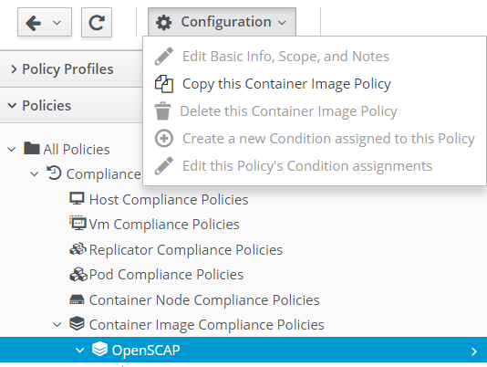

---
#### Acciones a realizar 

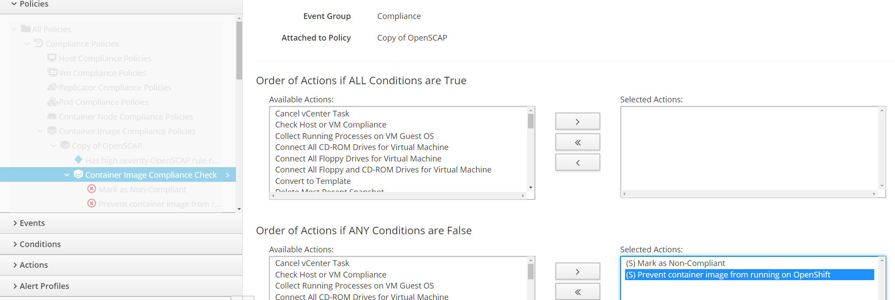

---
#### Acciones a realizar 

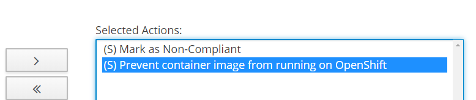

---
#### Nuevo Despliegue

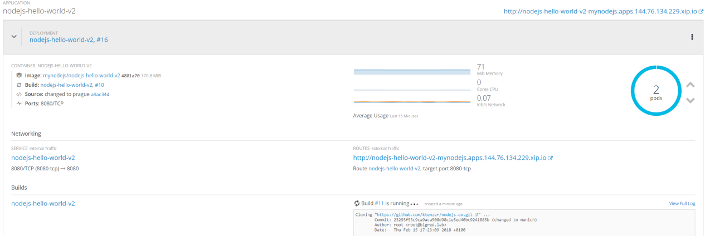

---
#### Información nuevo contenedor

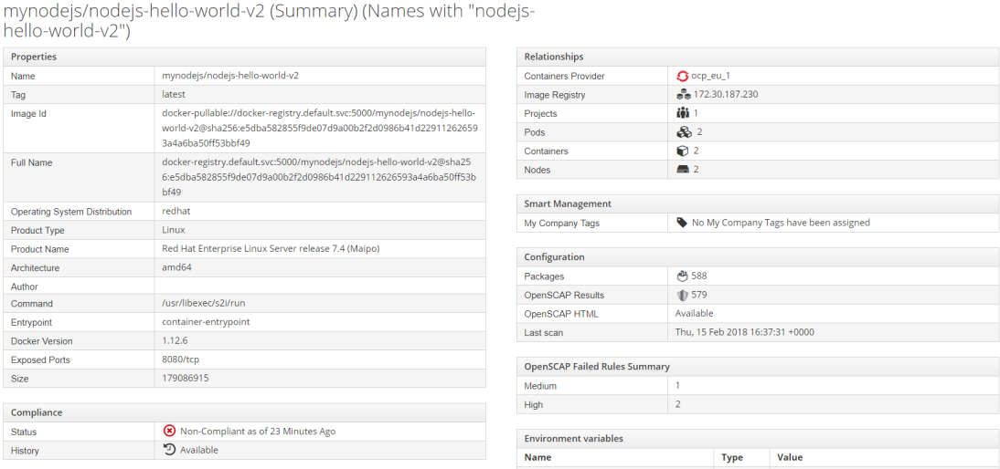

---
#### Información nuevo contenedor

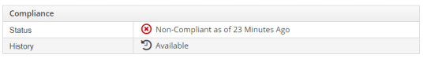

---
#### Informes con Cloudforms

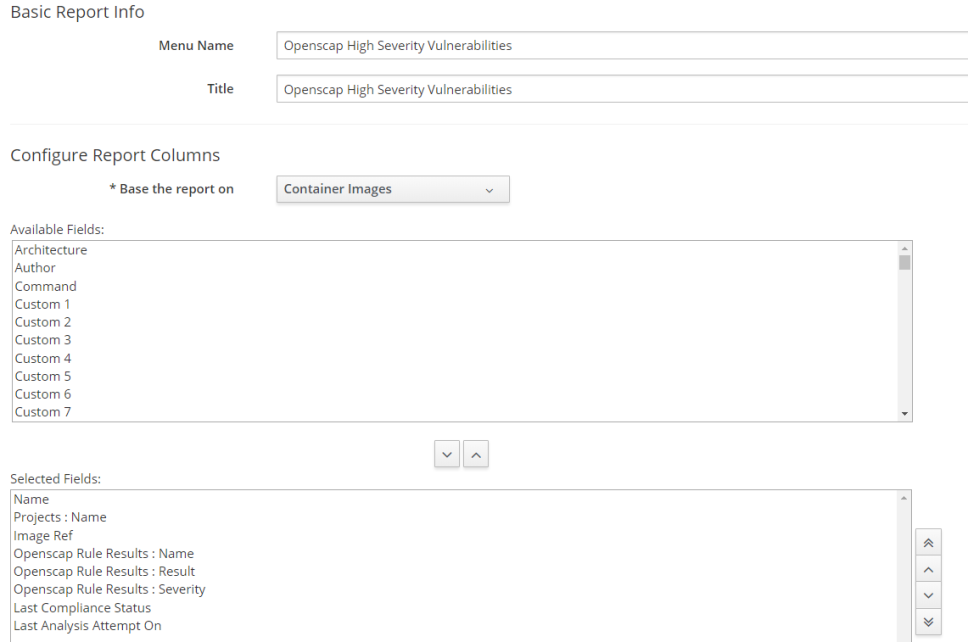

---
#### Reglas Informes

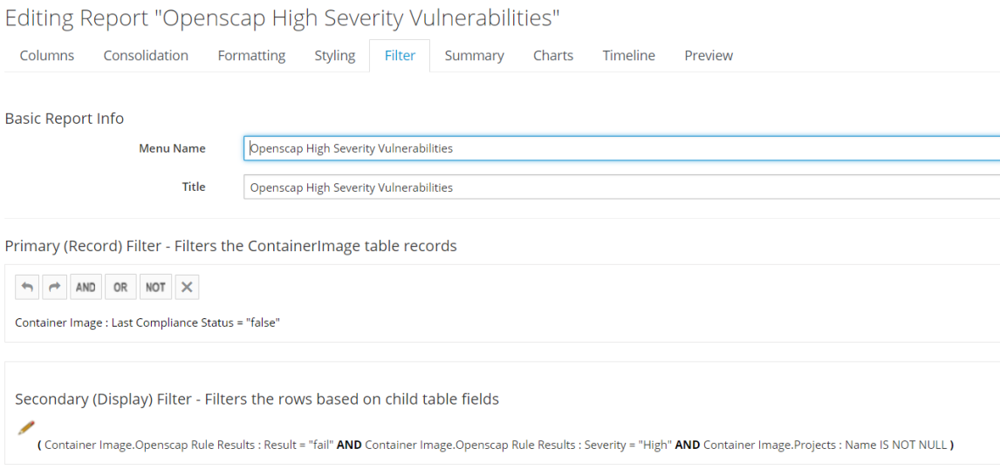

---
#### Resultados Informes

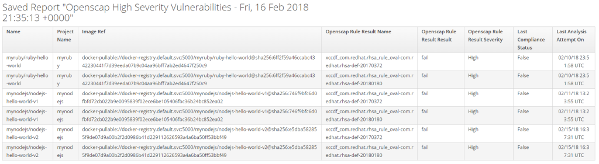

---
#### Detalles Informes

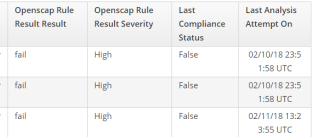

---
#### detalles con OpenScap 

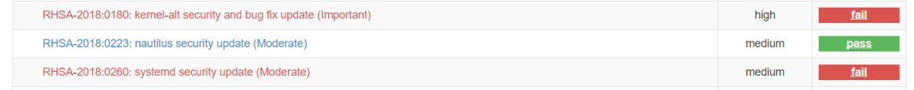

---
#### detalles con OpenScap 

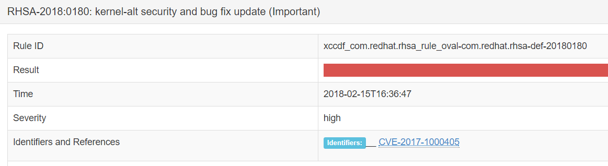

---
#### Escaneo de las aplicaciones

- RHEL/CentOS u OpenShift (CI/CD) permiten escaneos en tiempo real:
   - OpenSCAP
   - Aqua Security
   - Black Duck Hub
   - JFrog Xray
   - Twistlock

---
#### Escaneo de las aplicaciones
- Los escaneres permiten:
   - Catalogar las aplicaciones
   - Notificar vulnerabilidades
   - Nuevas vulnerabilidades en escaneos anteriores

---
## Resumen 

<!-- .slide: style="text-align: left;"> -->  
##### Catalago de Contenedores
##### Atomic CLI + OpenSCAP
##### Cloudforms + OpenSCAP + OpenShift

---
## ¿Preguntas?
<!-- .slide: style="text-align: left;"> -->  

- *twitter.com/javilinux*
- *javilinux@gmail.com*
- *github.com/javilinux/conferences/2018/supersec*

---
###### Mas información
<!-- .slide: style="text-align: left;"> -->  
[Proyecto Atomic](https://www.projectatomic.io/)

[Introducción al escaneo con Atomic Cli](https://developers.redhat.com/blog/2016/05/02/introducing-atomic-scan-container-vulnerability-detection/)

[Openshift](https://www.openshift.org/)

[OpenScap](https://www.open-scap.org/)

[manageiq](http://manageiq.org/)

[Ten layers of containers security](https://www.redhat.com/cms/managed-files/cl-container-security-openshift-cloud-devops-tech-detail-f7530kc-201705-en.pdf)
