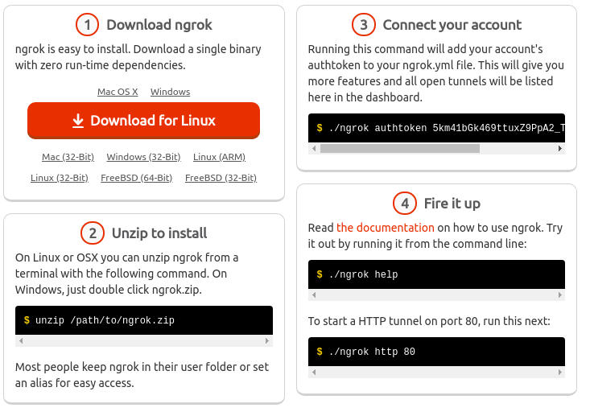

#### Introduction to Google Cloud Shell

*Javier Ramirez Molina*

*HackAndPaella February 2019*

---
#### Topics

- Overview
- Limits
- Session
- Web preview
- Opening a repository 
- Boost Mode
- Custom Image

---
## Overview 1/2

- Debian GNU/Linux 9 (stretch)
- Temporary g1-small for free
- Web browser based (gcloud ssh)
- Built-in code editor BETA
- 5 GB of persistent disk storage
- Pre-installed SDK and Built-in authorization for Google Cloud

---
## Overview 2/2

- Language support for Java, Go, Python, Node.js, PHP, Ruby and .NET
- Other tools installed: kubectl, docker, mysql, wget, git, pip, npm, tmux...
- Web preview
- Opening repositories / tutorials
- Boost Mode
- Customizations

---
<!-- .slide: data-background="./free.jpg" -->

---
## Limits

- Only $HOME is persistent
- Terminates after 1 hour of inactivatiy
- $HOME deleted after 120 days if not accessed
- 60 hours of weekly usage

---
## Session
[](https://console.cloud.google.com/cloudshell/editor?&shellonly=true)

```bash
gcloud alpha cloud-shell ssh
```

---
## Web preview

- Any port from 2000 to 65000
- Require authentication 


---
## Ngrok to the rescue




---
## Opening repositories / tutorials

- Github and bitbucket supported
- Parameters: repo, branch, working directory...

[](https://console.cloud.google.com/cloudshell/editor?cloudshell_git_repo=https%3A%2F%2Fgithub.com%2Fjavilinux%2Fconferences&cloudshell_working_dir=2019%2Fhackandpaella%2F&cloudshell_tutorial=tutorial.md)


---
## Boost Mode

- For 24h
- Normal - g1-small - 0.5 vCPU, 1.70GB
- Boost Mode - n1-standard-1 - 1 vCPU, 3.75GB

---
## Custom Image

- Using a custom image from google container registry
- Editing the Dockerfile
```bash
cloudshell launch-tutorial /google/devshell/tutorials/custom-image-tutorial.md
```

---
### THANK YOU!

- Questions?
- @javilinux
- javilinux@gmail.com
